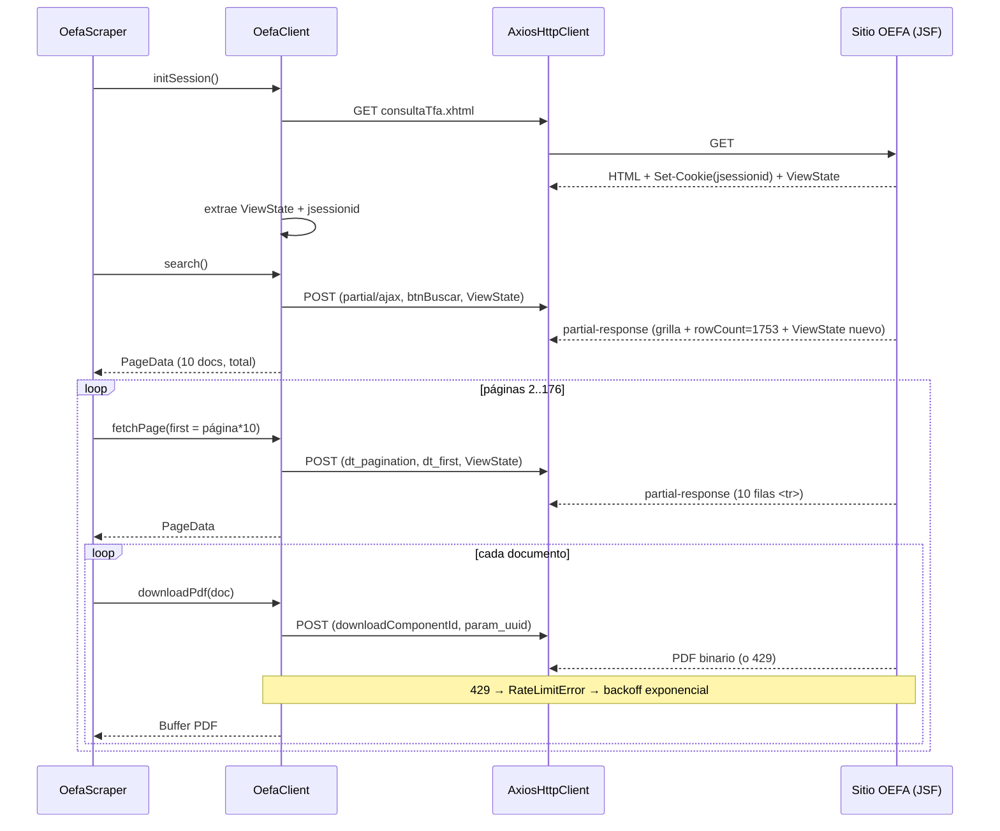
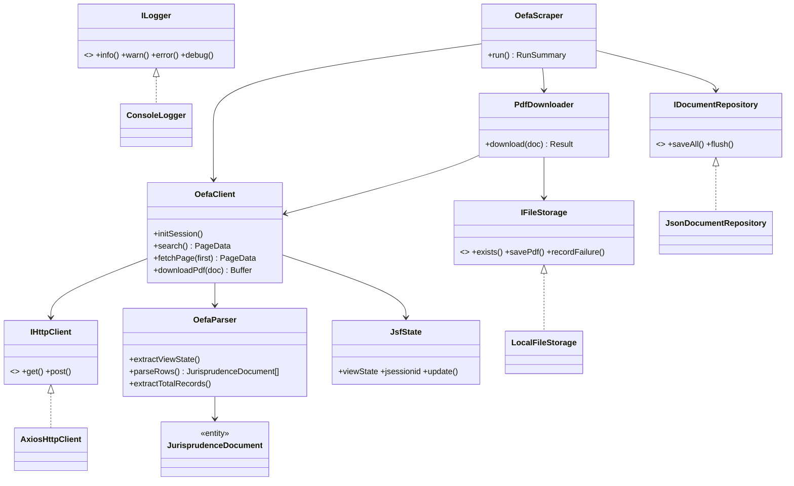
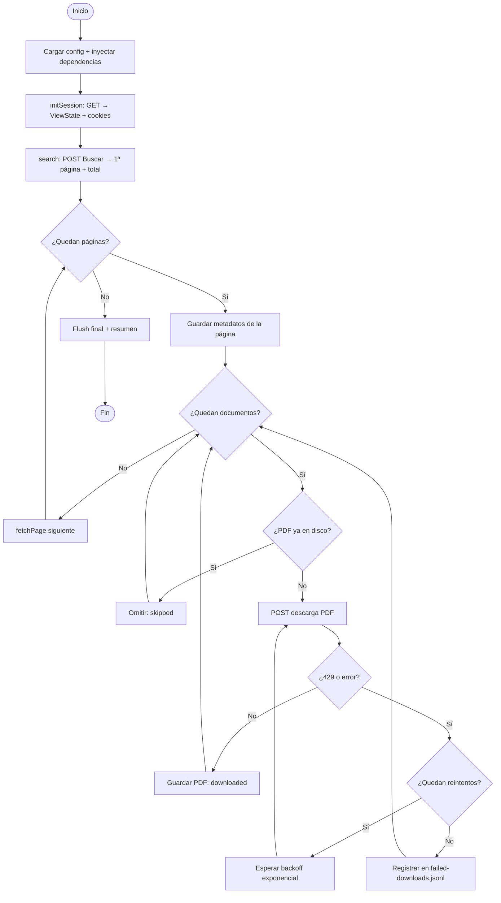

# Scraper OEFA — Tribunal de Fiscalización Ambiental

[](https://github.com/SanMaBruno/scraper-challenge/actions/workflows/ci.yml)


Scraper en TypeScript que recorre el [Registro de Resoluciones del Tribunal de
Fiscalización Ambiental (TFA) de OEFA](https://publico.oefa.gob.pe/repdig/consulta/consultaTfa.xhtml),
extrae los metadatos de cada resolución y descarga sus PDFs.

Está resuelto **sin automatización de navegador**: solo peticiones HTTP con
`axios` y parsing con `cheerio`. La gracia del reto no está en "bajar una tabla",
sino en que el sitio es una aplicación **JSF/PrimeFaces con estado en servidor**
—no hay API, hay que hablar su mismo protocolo— y en descargar cientos de PDFs
grandes conviviendo con el _rate limiting_ (HTTP 429) sin caerse a la mitad.

> **Sobre el sitio objetivo.** El enunciado apunta al portal del Poder Judicial
> (`jurisprudencia.pj.gob.pe`), que requiere VPN a Perú, y ofrece el de OEFA
> como alternativa pública equivalente. Desarrollé y validé contra OEFA. El
> diseño es el mismo para ambos: cambian la URL y los identificadores del
> formulario, no la arquitectura (ver [Portarlo a otro sitio](#portarlo-a-otro-sitio-jsf)).

---

## TL;DR

```bash
git clone https://github.com/SanMaBruno/scraper-challenge.git
cd scraper-challenge
npm install
npm test                  # 29 tests unitarios (~2 s, sin tocar la red)
npm run scrape:sample     # prueba real: 2 páginas, 3 PDFs (~30 s)
```

Salida real de esa corrida:

```
ℹ Se encontraron 1753 registros (176 páginas). Se recorrerán 2.
ℹ Página 1/2: 10 documentos.
ℹ PDF descargado (8.9 MB): 264-2012-OEFA-TFA__891-08-…__153a6d2a-….pdf
ℹ PDF descargado (4.8 MB): 007-2016-OEFA-TFA-SEPIM__857-2011-…__9c8d4d4a-….pdf
ℹ PDF descargado (13.2 MB): 019-2015-OEFA-TFA-SEPIM__853-2011-…__c49ed7f3-….pdf
ℹ ──────── Resumen de la ejecución ────────
ℹ Páginas visitadas:     2
ℹ Documentos extraídos:  20
ℹ PDFs descargados:      3
ℹ PDFs ya existentes:    0
ℹ PDFs fallidos:         0
```

Para la corrida completa (176 páginas, ~1753 PDFs): `npm run scrape`.

---

## Índice

- [Cómo llegué a la solución](#cómo-llegué-a-la-solución)
- [El protocolo del sitio, paso a paso](#el-protocolo-del-sitio-paso-a-paso)
- [Arquitectura](#arquitectura)
- [Decisiones de diseño (y por qué)](#decisiones-de-diseño-y-por-qué)
- [Manejo de errores 429 y resiliencia](#manejo-de-errores-429-y-resiliencia)
- [Tests](#tests)
- [Uso y configuración](#uso-y-configuración)
- [Salida generada](#salida-generada)
- [Diagramas](#diagramas)
- [Portarlo a otro sitio JSF](#portarlo-a-otro-sitio-jsf)
- [Limitaciones y próximos pasos](#limitaciones-y-próximos-pasos)

---

## Cómo llegué a la solución

Antes de escribir una línea, dediqué un rato a **entender el sitio con las
herramientas de red del navegador y `curl`**, porque de ahí sale todo el diseño:

1. **El HTML inicial ya lo dice casi todo.** El `<form>` viaja con un
   `javax.faces.ViewState` y un `jsessionid` incrustado en el `action`. Eso
   confirma que es **JSF con estado en servidor**: cada respuesta trae un token
   que hay que devolver en la siguiente petición. No sirve pedir una URL "de la
   página 2"; hay que reproducir la conversación completa.

2. **El botón _Buscar_ dispara un POST AJAX parcial** (`PrimeFaces.ab(...)`),
   no una recarga. La respuesta es un `partial-response` XML con la grilla y,
   escondido en un `<script>`, el dato clave: `rowCount:1753` → **176 páginas
   de 10**.

3. **La paginación es otro POST AJAX** contra el `DataTable`, con
   `dt_first = página × 10`. Un detalle que solo se ve mirando la respuesta
   cruda: **la búsqueda devuelve la grilla completa, pero la paginación devuelve
   solo las filas `<tr>` sueltas** (sin `<tbody>`). Esto obligó a que el parser
   fuera tolerante a ambos formatos —lo aprendí porque la primera versión sacaba
   0 documentos en la página 2—.

4. **La descarga del PDF es un POST de formulario completo** (no AJAX). El
   `onclick` de cada fila (`mojarra.jsfcljs(...)`) contiene el `param_uuid` del
   documento y el id del componente que dispara la descarga. Extrayendo ambos
   del HTML, reproduje el POST y el servidor respondió con el binario
   (`application/octet-stream`, verificado con la firma `%PDF-`).

Con esas cuatro piezas confirmadas a mano, recién ahí construí el código.

---

## El protocolo del sitio, paso a paso

| # | Acción            | Tipo                | Entrada clave                         | Salida                                  |
|---|-------------------|---------------------|---------------------------------------|-----------------------------------------|
| 1 | Abrir página      | `GET`               | —                                     | cookies (`jsessionid`) + `ViewState`    |
| 2 | Buscar            | `POST` AJAX parcial | botón `btnBuscar` + `ViewState`       | grilla 1ª página + `rowCount=1753`      |
| 3 | Paginar           | `POST` AJAX parcial | `dt_first`, `dt_rows`, `ViewState`    | 10 filas `<tr data-ri>` de esa página   |
| 4 | Descargar PDF     | `POST` formulario   | `downloadComponentId` + `param_uuid`  | PDF binario (o `429`)                   |

Cada respuesta AJAX trae un **`ViewState` nuevo** que se actualiza en memoria
(`JsfState`) antes de la siguiente petición; usar uno viejo rompe la sesión.

---

## Arquitectura

Arquitectura **hexagonal (puertos y adaptadores)**: el núcleo del scraper
depende de **interfaces**, y las tecnologías concretas (axios, sistema de
archivos, consola) son adaptadores enchufables. Esto no es ceremonia: es lo que
permite testear el parser con fixtures, cambiar el formato de salida sin tocar
la lógica, y —lo más útil aquí— portar el scraper a otro sitio JSF tocando una
sola capa.

```
src/
├── main.ts                          Composition root: arma e inyecta todo
├── config/config.ts                 Configuración (env vars + flags CLI)
│
├── core/                            Núcleo: no sabe de axios ni del filesystem
│   ├── domain/
│   │   └── JurisprudenceDocument.ts   Entidad + nombre de archivo descriptivo
│   └── ports/                         Contratos (interfaces) — el "hacia dónde" del DIP
│       ├── IHttpClient.ts
│       ├── IDocumentRepository.ts
│       ├── IFileStorage.ts
│       └── ILogger.ts
│
├── infrastructure/                  Adaptadores concretos de los puertos
│   ├── http/AxiosHttpClient.ts        HTTP + cookies + traduce 429 → RateLimitError
│   ├── logging/ConsoleLogger.ts
│   └── storage/
│       ├── JsonDocumentRepository.ts       Metadatos → documents.json
│       ├── CsvDocumentRepository.ts        Metadatos → documents.csv (mismo puerto)
│       ├── CompositeDocumentRepository.ts  Escribe a varios formatos a la vez
│       └── LocalFileStorage.ts             PDFs a disco + registro de fallos
│
├── scraper/                         El "cómo" del dominio OEFA
│   ├── JsfState.ts                    Custodia el ViewState / jsessionid
│   ├── OefaParser.ts                  HTML/XML → dominio (cheerio). Sin red.
│   ├── OefaClient.ts                  Traduce acciones a peticiones JSF
│   ├── PdfDownloader.ts               Descarga de 1 PDF: reintento + registro
│   ├── FailedDownloadRetrier.ts       Modo --retry-failed: consume la cola de fallos
│   └── OefaScraper.ts                 Caso de uso: orquesta todo el recorrido
│
└── shared/                          Transversal
    ├── errors.ts                      Errores tipados (RateLimitError, …)
    ├── retry.ts                       Backoff exponencial + jitter
    └── sleep.ts
```

**Regla de dependencia:** las flechas apuntan siempre hacia `core`. `OefaScraper`
no conoce axios; conoce `IHttpClient`. `main.ts` es el único lugar que instancia
clases concretas y las inyecta. Si mañana `axios` se cambia por `undici`, se toca
un archivo.

---

## Decisiones de diseño (y por qué)

Un scraper "que funciona" y uno mantenible se diferencian en las decisiones de
abajo. Dejo el razonamiento explícito porque es lo que evaluaría yo:

- **Sin Puppeteer/Playwright — no solo porque el reto lo prohíbe.** Reproducir
  el protocolo HTTP es **mucho más rápido y liviano** (no levanta un Chromium por
  cada request) y más honesto sobre lo que realmente hace el sitio. El costo es
  tener que entender JSF; ese costo ya está pagado.

- **`ViewState` aislado en `JsfState`.** Es el estado más frágil y contagioso del
  sistema. Encerrarlo en una clase con `update()` evita que ande esparcido como
  variable global por todo el código, que es exactamente donde estos scrapers se
  vuelven imposibles de mantener.

- **El parser no toca la red, y punto.** `OefaParser` recibe un `string` y
  devuelve dominio. Esa frontera lo hace testeable con un HTML guardado, sin
  depender del sitio en vivo (que además tiene rate limiting).

- **Identificadores JSF centralizados en un objeto `FORM`.** Los `j_idt21`,
  `j_idt63`, etc. son el punto más frágil (cambian si redespliegan la app). En
  vez de esparcirlos como strings mágicos, están en un solo lugar rotulado. El
  `param_uuid` y el `downloadComponentId`, en cambio, **se extraen dinámicamente**
  del `onclick` de cada fila, que es lo robusto.

- **Persistencia incremental (`flush` por página).** Con 176 páginas y descargas
  de 10 MB, asumir que el proceso llega entero al final es optimista. Se vuelca
  `documents.json` tras cada página: si se corta en la 90, no se perdió nada.

- **Reanudable por diseño.** Antes de descargar, se comprueba si el PDF ya existe
  en disco. Reejecutar retoma donde quedó en lugar de empezar de cero —clave
  cuando la corrida completa son gigas de PDFs—.

- **Un fallo de descarga no aborta la corrida.** Si un PDF agota los reintentos,
  se registra en `failed-downloads.jsonl` y se sigue con el siguiente. El
  enunciado lo pide, y es lo correcto: un 429 terco en un documento no puede
  costar las otras 1752.

- **Errores tipados en vez de `catch (e)` genérico.** `RateLimitError` permite
  que la política de reintento distinga "el servidor me está frenando, respeto su
  `Retry-After`" de "se cayó la red". Reaccionar distinto exige poder distinguir.

### SOLID, en concreto (no como eslogan)

- **S** — cada clase cambia por un solo motivo: `OefaParser` si cambia el HTML,
  `AxiosHttpClient` si cambia el transporte, `PdfDownloader` si cambia la política
  de descarga.
- **O** — la salida CSV se agregó como una clase nueva (`CsvDocumentRepository`)
  sin tocar el scraper; `--format=both` combina ambas con `CompositeDocumentRepository`.
- **L** — cualquier `IHttpClient` (incluido el doble de prueba en los tests)
  sustituye al real, como se ve en `PdfDownloader.test.ts`.
- **I** — interfaces chicas y separadas (`IFileStorage`, `IDocumentRepository`, …)
  en lugar de una interfaz "Dios".
- **D** — el núcleo depende de `core/ports`; lo concreto se inyecta en `main.ts`.

---

## Manejo de errores 429 y resiliencia

El 429 es el corazón del reto, así que la estrategia es explícita:

1. **Detección tipada.** `AxiosHttpClient` convierte cualquier `HTTP 429` en un
   `RateLimitError`, leyendo `Retry-After` si el servidor lo envía.
2. **Backoff exponencial con jitter.** `withRetry` espera
   `base × 2^(intento−1)` acotado por un máximo, más una pequeña aleatoriedad
   (para no reintentar todos al mismo tiempo). Si vino `Retry-After`, se respeta
   ese valor por encima del cálculo.
3. **Se agotan los reintentos → se registra y se sigue.** El documento va a
   `failed-downloads.jsonl` con el motivo y el nº de intentos. Un 429 terco en
   un documento no puede costar los otros 1752.
4. **El ciclo se cierra con `--retry-failed`.** Ese modo consume la cola de
   fallos en una sesión nueva: navega hasta la página donde vive cada fila
   (el índice viene codificado en el `downloadComponentId`), **re-localiza el
   documento por su `pdfUuid` con datos frescos** —el componentId viejo no
   sirve en otra sesión JSF— y lo descarga. Los que vuelvan a fallar se
   re-registran solos; los recuperados salen del ciclo.

   ```bash
   npm run scrape:retry-failed
   ```

5. **Cortesía con el servidor.** Delay configurable entre peticiones y un
   `User-Agent` identificable. No se trata de exprimir el sitio, sino de
   convivir con él.

La misma política de reintento cubre también los fallos transitorios de red en la
navegación (búsqueda y paginación), no solo las descargas.

---

## Tests

```bash
npm test              # corre las 29 pruebas
npm run test:coverage # con reporte de cobertura
```

La suite (Jest + ts-jest) es rápida y **no toca la red**: el parser se prueba
contra **respuestas reales del sitio guardadas como fixtures** (`tests/fixtures/`,
capturadas con `curl`), y la lógica de descarga se prueba con **dobles de prueba**
—un `IHttpClient`/`IFileStorage` en memoria— gracias a la inversión de
dependencias. Esto permite simular un 429 de forma determinista, sin depender del
rate limiting real.

| Suite                         | Qué cubre                                                        |
|-------------------------------|------------------------------------------------------------------|
| `OefaParser.test.ts`          | Extracción de ViewState, total y filas (grilla completa **y** paginación sin `<tbody>` — el bug que encontré). |
| `PdfDownloader.test.ts`       | Caso feliz, reanudación (PDF ya en disco), reintento ante 429 y registro del fallo sin abortar. |
| `FailedDownloadRetrier.test.ts` | Modo `--retry-failed`: agrupación por página, re-localización por uuid y limpieza de la cola. |
| `retry.test.ts`               | Backoff: éxito, reintentos, agotamiento, propagación del nº de intento. |
| `JurisprudenceDocument.test.ts` | Nombre de archivo descriptivo, sin acentos ni caracteres inválidos. |
| `JsfState.test.ts`            | Custodia del ViewState/jsessionid entre peticiones.              |

```
Test Suites: 6 passed, 6 total
Tests:       29 passed, 29 total
```

La misma suite corre en **GitHub Actions** (Node 18 y 20) en cada push — ver el
badge de CI arriba.

> El test de paginación es a la vez un **test de regresión**: fija el
> comportamiento correcto del caso que en la primera versión devolvía 0
> documentos, para que no vuelva a romperse.

---

## Uso y configuración

**Requisitos:** Node.js ≥ 18 y npm ≥ 9.

```bash
npm install

npm run scrape:sample     # 2 páginas, 3 PDFs — para validar rápido
npm run scrape            # corrida completa (todas las páginas y PDFs)
npm run scrape:retry-failed # reintenta la cola de descargas fallidas
npm run build && npm start  # compila a dist/ y ejecuta el JS
npm test                  # tests unitarios
npm run typecheck         # solo chequeo de tipos
```

Se puede ajustar todo por **flags de CLI** (tienen prioridad) o **variables de
entorno**:

```bash
npx ts-node src/main.ts --max-pages=5 --max-pdfs=10 --delay=2000
```

| Flag CLI        | Env var               | Default     | Qué controla                                   |
|-----------------|-----------------------|-------------|------------------------------------------------|
| `--max-pages=N` | `MAX_PAGES`           | `0` (todas) | Páginas a recorrer.                            |
| `--max-pdfs=N`  | `MAX_PDFS`            | `0` (todos) | PDFs a descargar (útil para pruebas).          |
| `--format=X`    | `OUTPUT_FORMAT`       | `json`      | Formato de metadatos: `json`, `csv` o `both`.  |
| `--retry-failed` | —                    | off         | Reintenta solo la cola de fallos y termina.    |
| `--delay=MS`    | `REQUEST_DELAY_MS`    | `1500`      | Espera entre peticiones (ms).                  |
|                 | `BASE_URL`            | OEFA        | Host del sitio.                                |
|                 | `RESULT_PATH`         | `/repdig/…` | Ruta de la página de resultados.               |
|                 | `OUTPUT_DIR`          | `./data`    | Carpeta de salida.                             |
|                 | `PAGE_SIZE`           | `10`        | Registros por página (según la grilla).        |
|                 | `RETRY_MAX_ATTEMPTS`  | `5`         | Reintentos ante fallo/429.                     |
|                 | `RETRY_BASE_DELAY_MS` | `2000`      | Retardo base del backoff.                      |
|                 | `RETRY_MAX_DELAY_MS`  | `60000`     | Tope del backoff.                              |
|                 | `DEBUG`               | —           | `DEBUG=1` activa logs de depuración.           |

---

## Salida generada

Todo va a `./data/` (ignorada por Git):

```
data/
├── documents.json          Metadatos (formato por defecto)
├── documents.csv           Metadatos en CSV (con --format=csv o both)
├── failed-downloads.jsonl  Descargas fallidas, una por línea, para reintentar
└── pdfs/                    PDFs con nombre descriptivo:
    └── 264-2012-OEFA-TFA__891-08-PRODUCE-DIGSECOVI-Dsvs__<uuid>.pdf
```

El nombre del PDF combina nº de resolución + nº de expediente + uuid: legible
para un humano y único para la máquina. Un registro de `documents.json`:

```json
{
  "rowNumber": 11,
  "fileNumber": "657-2011-PRODUCE/DIGSECOVI-Dsvs",
  "administered": "Instituto Tecnológico de la Producción",
  "inspectableUnit": "Planta de procesamiento de recursos hidrobiológicos…",
  "sector": "Pesquería",
  "resolutionNumber": "236-2013-OEFA/TFA",
  "pdfUuid": "746821e4-f99f-4e5c-90e2-7e2e2e3731d8",
  "downloadComponentId": "listarDetalleInfraccionRAAForm:dt:10:j_idt63"
}
```

---

## Diagramas

### Secuencia — la conversación con el sitio



### Clases — piezas y dependencias



### Actividad — flujo de ejecución



---

## Portarlo a otro sitio JSF

Para apuntar al portal del Poder Judicial (u otro JSF/PrimeFaces) el cambio está
acotado a **dos lugares**, gracias a la separación de capas:

1. **Config** — `BASE_URL` y `RESULT_PATH` (por env var, sin tocar código).
2. **Identificadores del formulario** — el objeto `FORM` en `OefaClient.ts` y,
   si difieren las columnas, el mapeo en `OefaParser.parseRows()`.

Toda la maquinaria de sesión, ViewState, paginación, backoff y descarga se
reutiliza tal cual.

---

## Limitaciones y próximos pasos

Siendo honesto sobre lo que no está y lo haría a continuación:

- **Identificadores `j_idt` frágiles.** Si OEFA redespliega la app pueden
  cambiar. Están centralizados para que el arreglo sea de un renglón; una versión
  más robusta los descubriría parseando el `onclick` del botón _Buscar_.
- **Descargas secuenciales.** Concurrencia acotada (p. ej. 2–3 en paralelo)
  aceleraría la corrida completa, a cambio de más presión sobre el rate limiting.
  Preferí la opción amable y predecible; el _pool_ de concurrencia sería la
  siguiente mejora.
- **Sesión única.** Si la vista JSF expira a mitad de una corrida muy larga, el
  scraper lo detecta y lo reporta (`ViewExpiredException`), pero no renegocia la
  sesión automáticamente todavía; reejecutar retoma donde quedó gracias a la
  reanudación.

---

## Autor

**Bruno San Martín Navarro** — Valdivia, Chile 🇨🇱

- GitHub: [@SanMaBruno](https://github.com/SanMaBruno)
- LinkedIn: [linkedin.com/in/sanmabruno](https://www.linkedin.com/in/sanmabruno)

Hecho como parte del desafío de scraping de Magnar AI. Licencia [MIT](LICENSE).
